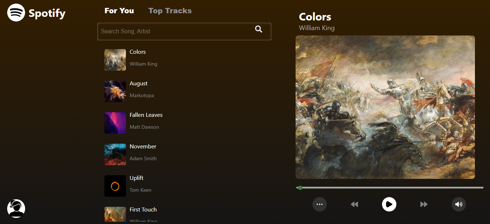
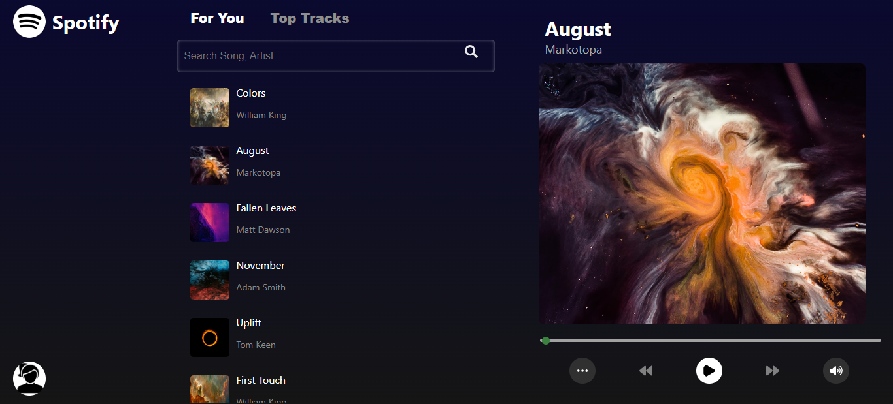
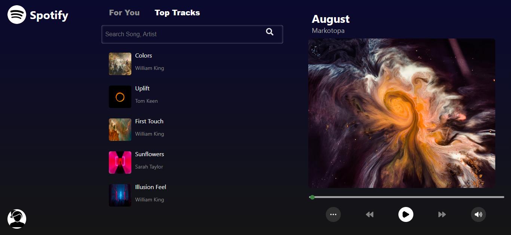
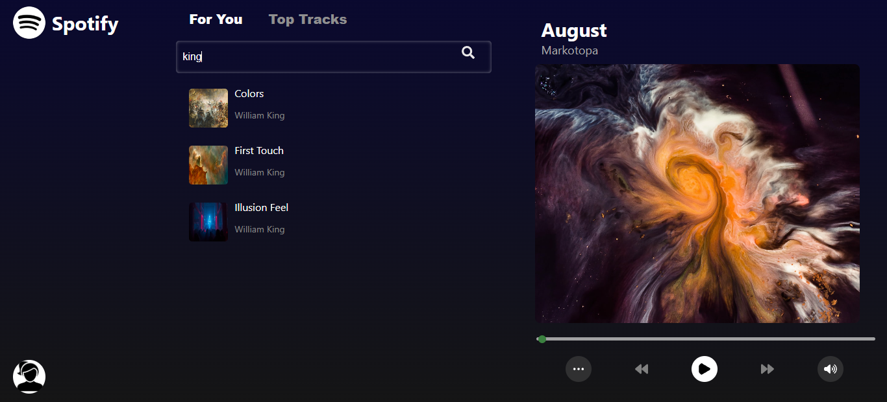
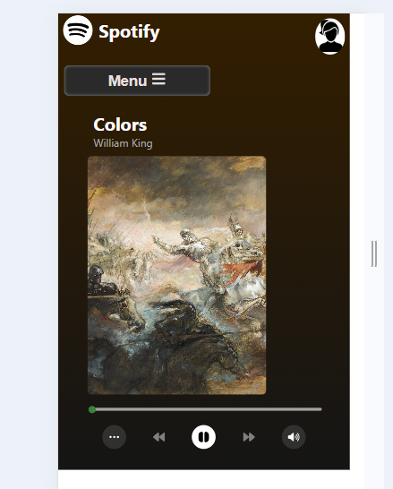

# 🎵 React Music Player App

This application allows you to listen to your favorite songs, navigate through a playlist, and enjoy a sleek, modern UI. Built with React, the app features a sidebar for song selection, a player with essential controls, and user-friendly search and filtering functionalities.

## 🚀 Deployment Link

[Music Player](https://6684eb4ea1c92d96dcce79ce--taupe-genie-019a89.netlify.app)

## 🎬 Application Demo


https://github.com/Snehal-Salvi/Music-Player/assets/125987932/97aa0056-9e77-4da5-8751-18e3f6fd80be


## 📸 Snapshots

- **Home Page**



- **Background Effect Chnage**



- **Top Track Section**



- **Search Functionality**


 
- **Responsive UI**




## ✨ Features

- **Search Song**: Search your favorite song or artist by name.
- **Play and Pause**: Control the playback of your current song with play/pause functionality.
- **Previous and Next**: Navigate through the songs in your playlist with ease.
- **Volume Control**: Toggle between volume on and mute.
- **Seek Slider**: Jump to different parts of the song with a seek bar.
- **Song Selection**: Choose songs from a sidebar, with search and category filtering.
- **Tab change**: For You and Top Tracks section to choose the songs.
- **Responsive Design**: Adapted for both large screens and small screens (mobile-friendly).

## 🛠️ Installation
To set up and run the app locally, follow these steps:

1. Clone the repository.
2. Navigate to the project directory:
3. Install the necessary dependencies:

```
npm install
```

4. Run the project.

```
npm start
```

5. The app will start running on http://localhost:3000.

## Technologies Used

- React JS
- HTML CSS
- JavaScript

## 🚀 Usage

### Starting the App

To start the app, run `npm start` in your terminal. This will launch the app in development mode.

Open [http://localhost:3000](http://localhost:3000) in your web browser to use the app.

### Interacting with the App

- **Selecting a Song**: Click on any song in the sidebar to load it into the player.
- **Play/Pause**: Use the play/pause button to control the playback.
- **Navigation**: Use the forward and backward buttons to skip through the songs in your playlist.
- **Volume**: Toggle the volume using the volume button.
- **Seeking**: Use the slider to jump to different parts of the currently playing song.

### Sidebar

- **Search**: Use the search bar to filter songs by name or artist.
- **Categories**: Switch between "For You" and "Top Tracks" categories.


## Authors

- [@Snehal](https://github.com/Snehal-Salvi)

